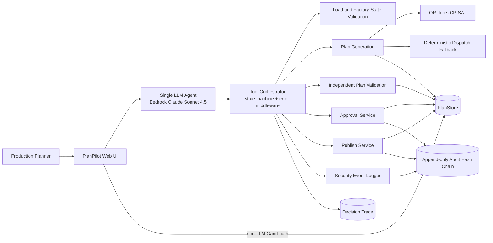
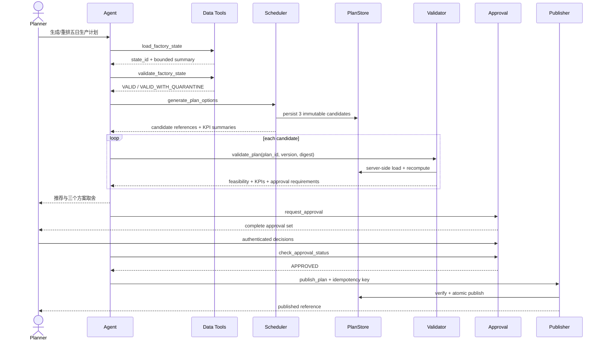
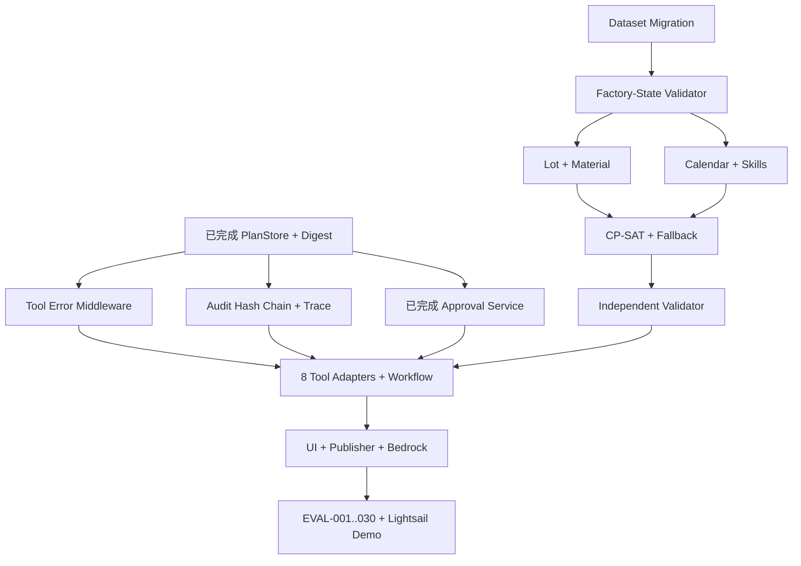

# PlanPilot AI 黑客松 Agent 完整设计方案

> 团队协作版 · 基于 `planpilot_agent_contract_v1.8.json`  
> 文档日期：2026-09-14 · 时区：Asia/Singapore（UTC+08:00）  
> 当前代码基线：`approval-service-v1-baseline` / `069f9f8`  
> 契约 SHA-256：`b92e53f4ff0541050ec6585f3237f4d764a26e455447a672f3419dfb284fe639`

## 1. 这份文档解决什么问题

这是一份给 PlanPilot 全体组员阅读的系统总设计。它回答：

- 我们为谁解决什么问题；
- Agent 为什么这样设计，而不是让大模型直接生成排程；
- 数据、求解器、校验器、审批、发布、审计和 UI 如何协作；
- 哪些决策由 Agent 自动完成，哪些必须由人确认；
- 当前已经实现什么、尚缺什么；
- 接下来两周如何分工，怎样形成可以被评委验证的证据。

本文件帮助团队理解和实施，但不是新的需求来源。发生冲突时，优先级为：

1. `contract/planpilot_agent_contract_v1.8.json`；
2. 契约生成的 `.kiro/steering/`；
3. 各模块 `.kiro/specs/<part>/design.md`；
4. 本总设计文档。

## 2. 一页摘要

PlanPilot 是面向制造业 SME Production Planner 的生产计划协作 Agent。它读取结构化工厂工作簿，在五个工作日的滚动窗口内生成三个可比较的有限产能计划，独立验证每个计划，解释交期、加班、换型和稳定性的取舍，并在加班、客户交期变更、次要技能派工以及发布前等待人工批准。

最重要的架构原则是：

> LLM 负责理解意图、调用工具、比较结果和解释；确定性程序负责所有计划字段、数学计算、约束、KPI、审批状态和发布。

因此，大模型即使产生幻觉，也不能把不存在的机器、工人、库存或批准写入正式计划。正式计划是服务器端不可变对象，有版本号和 SHA-256 digest；审批也绑定同一个 `plan_id + plan_version + plan_digest`。计划一旦重生成，旧审批立即失效。

系统只使用一个 LLM Agent。CP-SAT、独立校验器和审批服务不是其他 LLM Agent，而是确定性工具。这降低了不可验证的推理面，也让安全性不依赖模型品牌。

## 3. 业务问题与产品定位

### 3.1 官方赛题

赛道为 NUS-ISS “Show Me Your Agents” Hackathon 的 **Production Planning**。

生产计划员需要协调：

- 客户订单；
- 可用库存与确认入库；
- 机器产能；
- 工人排班和技能；
- 紧急订单、设备故障、物料延迟、人员缺勤及客户需求变化。

现状主要依赖电子表格和经验，导致重排慢、约束错误难发现、方案取舍难量化、决策难追溯。

### 3.2 Demo 企业

- 企业：LionCity Precision Pte. Ltd.（虚构的新加坡精密工程 SME）；
- 模式：high-mix、low-volume、小批量制造；
- 用户：Production Planner；
- 计划节奏：每日计划 + 事件触发重排；
- 计划窗口：连续五个工作日；
- 班次：每工作日两个八小时班次。

### 3.3 用户价值

| 痛点 | PlanPilot 的回答 |
|---|---|
| 排产和重排耗时 | 在统一 SLA 内生成并验证多个计划 |
| 隐藏的可执行性错误 | 独立校验机器、工人、技能、物料、班次和工艺路线 |
| 只能看到一个方案 | 同时比较 Balanced、Delivery First、Cost First |
| 不知道为什么移动工序 | 输出原因、受影响订单、KPI 变化、批准状态和 decision trace |
| AI 越权 | 关键字段由工具拥有，后果性动作必须人工批准 |

### 3.4 明确不做

- 黑客松期间不连接真实 ERP/MES 写回；
- 不自动采购或与供应商谈判；
- 不训练预测性维护模型；
- 不微调基础模型；
- 不自动向客户承诺新交期；
- 不允许覆盖安全、技能或维护约束；
- 不声称物料分配达到全局最优。

## 4. 目标、指标与完成定义

### 4.1 产品目标

1. 在五日窗口内快速给出可执行计划；
2. 硬约束违规率为 0；
3. 在不遗漏困难工序的前提下提高按时交付表现；
4. 事件重排后计划稳定性达到 0.70 或更高；
5. 每项建议都能追溯到原因、KPI、审批和工具记录。

### 4.2 SLA

一次重排只有一个端到端时钟：

| 阶段 | 预算 |
|---|---:|
| 加载与输入校验 | 4 秒 |
| 计划生成 | 40 秒 |
| 独立计划校验 | 8 秒 |
| 序列化与响应 | 2 秒 |
| 内部余量 | 1 秒 |
| 内部截止 | 55 秒 |
| EVAL 严格阈值 | 小于 60 秒 |

人工等待审批以及后续发布延迟不计入重排 SLA。

### 4.3 不能提前宣称的结果

当前 V1.8 baseline 需要重新计算，旧版 `0.8333` 按时率不可比较。在完成新数据集、完整引擎、独立校验器和 EVAL-001～030 前，不得宣称：

- 系统已经 pilot-ready；
- 按时率已经提升；
- 端到端小于 60 秒已经被证明；
- 物料分配是最优的；
- 所有黑客松验收场景已经通过。

## 5. 核心设计原则

### 5.1 一个 Agent，多个确定性工具

LLM 可以：

- 理解用户想要计划、重排、比较还是发布；
- 选择和按顺序调用工具；
- 比较已经验证的候选摘要；
- 用自然语言解释取舍；
- 请求人工批准。

LLM 不可以：

- 计算排程或 KPI；
- 判断硬约束是否满足；
- 编写或修改任何 `plan_content` 字段；
- 伪造库存、产能、技能、交期或审批；
- 读取完整 operations 数组；
- 执行客户备注或事件 payload 中的指令。

### 5.2 正确性不依赖 LLM

即使更换模型，计划可行性也不应变化。模型供应商只影响意图理解和解释质量；求解、校验、审批和发布均由确定性代码控制。

### 5.3 先验证，再推荐，再批准，再发布

任何“看起来合理”的计划都不能绕过独立验证。任何批准都不能绕过版本和 digest 绑定。任何失败都不能返回半个计划或留下业务状态修改。

### 5.4 大对象绕过 LLM

完整 operation 数组保存在 PlanStore，校验器和 UI 通过非 LLM 数据通道读取。送给 Agent 的只有有界摘要、ID、版本、digest、KPI 和审批状态。这同时解决上下文膨胀、转录损坏、token 成本和计划字段被模型修改的问题。

## 6. 系统总体架构



### 6.1 信任边界

| 区域 | 信任等级 | 规则 |
|---|---|---|
| 用户自然语言 | 非结构化、不可直接执行 | 只用于意图理解 |
| Orders 客户备注、Events Payload | 明确不可信 | 只能作为被引用的数据，不能成为指令 |
| LLM narrative | 受限生成 | 只能复述工具输出中的事实 |
| 工具输入/输出 | Schema 边界 | Draft 2020-12，`additionalProperties:false` |
| 求解器、校验器 | 确定性可信计算边界 | 固定版本、固定排序、固定预算 |
| PlanStore | 正式计划事实源 | 内容不可变，生命周期独立可变 |
| ApprovalService | 后果性动作授权源 | 完整集合、服务器时间、版本/digest 绑定 |
| Audit Chain | 追溯证据 | append-only、hash-chained |

## 7. Agent 工作流与状态机

### 7.1 正常路径



### 7.2 十一个状态

`RECEIVED → DATA_LOADED → INPUT_VALIDATED → PLANS_GENERATED → PLANS_VALIDATED → RECOMMENDED → AWAITING_APPROVAL → APPROVED → PUBLISHED`

旁路状态：

- `REJECTED`：任一所需审批被拒绝；
- `BLOCKED`：数据非法、无可行计划、搜索预算耗尽或完整性服务失败。

`PUBLISHED`、`REJECTED` 和 `BLOCKED` 是 resting state，不是永远结束：

- 新事件或次日运行：`PUBLISHED → RECEIVED`；
- 根据受控拒绝原因重排：`REJECTED → PLANS_GENERATED`；
- 数据或依赖修复：`BLOCKED → RECEIVED`。

### 7.3 失败语义

- retryable framework error 保持当前状态，不延长原 SLA；
- 非 retryable domain error 可让 orchestrator 进入 `BLOCKED`；
- tool error 永远不是 plan、partial plan 或 approval outcome；
- 失败调用不改变业务状态，唯一例外是阻断攻击时明确记录 append-only security audit。

## 8. 八个固定工具

工具名称和参数由契约固定，不得自行新增、改名或扩展参数。

| 工具 | 责任 | Agent 能看到的核心结果 |
|---|---|---|
| `load_factory_state` | 读取、标准化工作簿，解析滚动窗口和事件 | `state_id`、摘要、数据版本 |
| `validate_factory_state` | Schema、引用、日期、产能、技能、物料覆盖和不可信文本检查 | VALID / VALID_WITH_QUARANTINE / INVALID、issues、quarantine |
| `generate_plan_options` | 固定批次、物料预留、排程、KPI，持久化候选 | 三个候选引用和有界比较摘要 |
| `validate_plan` | 按 ID/version/digest 服务端取计划并独立重算 | feasibility、hard violations、KPIs、approval requirements |
| `request_approval` | 为计划创建完整审批集合；action 只是触发器 | 完整 `approval_set_snapshot` |
| `check_approval_status` | 读取服务器权威审批结果并执行过期规则 | PENDING / APPROVED / REJECTED / EXPIRED / INVALIDATED |
| `publish_plan` | 重验 digest、版本、完整审批、幂等 key，原子发布 | published plan reference |
| `log_security_event` | 记录阻断和安全事件 | hash-chain audit reference |

每个工具必须有：

- 成功 payload schema；
- 公共 `tool_error` failure envelope；
- lowercase UUIDv4 `correlation_id`；
- 精确的 retryable 标志；
- 不超过 4096 UTF-8 bytes 的完整错误信封；
- decision trace。

十八个注册错误码为：

`INVALID_INPUT`、`STATE_NOT_FOUND`、`VALIDATION_FAILED`、`NO_FEASIBLE_PLAN`、`DEADLINE_EXCEEDED`、`SEARCH_ESCALATION_EXHAUSTED`、`RATE_LIMITED`、`APPROVAL_REQUIRED`、`APPROVAL_REJECTED`、`APPROVAL_EXPIRED`、`APPROVAL_WINDOW_CLOSED`、`APPROVAL_SET_INVALIDATED`、`APPROVAL_SET_INCOMPLETE`、`PLAN_VERSION_CONFLICT`、`PLAN_DIGEST_MISMATCH`、`IDEMPOTENCY_CONFLICT`、`POLICY_VIOLATION`、`INTERNAL_ERROR`。

## 9. 数据设计

### 9.1 工作簿的 17 个 Sheet

| 分组 | Sheet |
|---|---|
| 元数据与规则 | README、Assumptions、Objectives、Approval Policy、Evaluation Cases、Plan Output Schema |
| 需求与产品 | Orders、Products、Routing |
| 资源 | Machines、Workers、Worker Skills、Shift Calendar |
| 物料与换型 | Inventory、Changeovers |
| 事件与比较 | Events、Baseline Schedule |

关键 V1.8 字段包括：

- Products/BOM：`requires_material`、正整数 `max_lot_size`、base-unit BOM；
- Inventory：稳定 `source_id`、`ON_HAND` / `CONFIRMED_INBOUND`、`available_at`；
- Worker Skills：`proficiency_level 1..5`、`is_primary`；
- Shift Calendar：machine/worker group、REGULAR/OVERTIME、`calendar_window_id`；
- Routing：每条完整路线以 `INSPECTION` 结束；
- Events：EVT-001～EVT-007，包括数量调整和交期提前。

### 9.2 输入校验和 quarantine

结构错误、引用错误和依赖错误以 record level quarantine 处理。一个坏订单及依赖它的 routing/BOM 可以被隔离，而其他合法订单继续计划；但 quarantine 必须显式出现在输出和 KPI 分母说明中，不能借隔离隐藏困难订单。

状态：

- `VALID`：没有阻断问题；
- `VALID_WITH_QUARANTINE`：部分记录被隔离，其余可继续；
- `INVALID`：全局或关键数据问题阻止计划。

校验器只能使用契约中的 36 个 `validation_issue_code`，不得临时造新词。

### 9.3 滚动窗口

窗口不是写死常量，而是从 `load_factory_state.as_of_time` 和 Shift Calendar 推导的连续五个工作日。Demo 固定实例为 2026-09-14 至 2026-09-18；事件触发重排保持同一个窗口，次日计划则将窗口向前滚动。

## 10. 排程引擎设计

### 10.1 处理流水线

```text
已验证工厂状态
  → 固定批次拆分
  → 按全局优先级预留物料
  → 计算每个 lot 的 earliest_material_ready_time
  → 建立机器/工人可用日历交集
  → CP-SAT 求解三个 profile
  → 必要时进入确定性 dispatch fallback
  → 计算 12 项 KPI
  → 写入不可变 plan_content
  → 独立 validate_plan 重算和验证
```

### 10.2 固定批次拆分

黑客松范围采用 `FIXED_MAX_SIZE_DECOMPOSITION`：

```text
lot_count = ceil(order_quantity / max_lot_size)
前 N-1 个 lot = max_lot_size
最后一个 lot = order_quantity - (N-1) * max_lot_size
```

所有 lot quantity 必须为正，不超过 `max_lot_size`，总和等于订单数量。每个 lot 拥有完整 routing，并以 INSPECTION 收尾。求解器自由选择批次数量不在本次范围；如果 `allow_optional_lot_splitting=true`，返回 `OPTIONAL_LOT_SPLITTING_UNSUPPORTED`。

### 10.3 确定性物料预留与 release time

这是避免“先排程后算物料、物料时间又反过来改变排程”的因果循环的关键。

Lot 全局优先级：

```text
urgent_flag 降序
→ promised_due_at 升序
→ order_id 升序
→ lot_no 升序
```

每种物料的 bucket 顺序：

```text
available_at 升序
→ 同时刻 ON_HAND 先于 CONFIRMED_INBOUND
→ source_id 升序
```

算法：

1. 将物料数量统一为 EA/G/ML 的正整数 base units，禁止浮点库存运算；
2. 对每个 lot 的全部 BOM line 进行 tentative reservation；
3. 只有全部 line 都能满足时才原子提交这个 lot；
4. 任一 line 不足则回滚该 lot 的全部 tentative allocation；
5. READY lot 的 `earliest_material_ready_time` 等于其所有已分配 bucket 的最晚 `available_at`；
6. 该时间成为 lot 首个 PRODUCTION 工序的 release time；
7. SHORTAGE lot 不送入 solver，完整 routing 写入 `unscheduled_operations`，原因是 `MATERIAL_SHORTAGE`。

这是一遍式、求解前预留，没有 post-solve re-reservation 或 fixed-point loop，因此结果不依赖求解器搜索顺序。已知代价是：某个 READY lot 后来可能因产能没排上，但仍持有物料；这是保守的最优性损失，不是硬约束错误，必须在推荐里显式披露。

### 10.4 日历和加班

- 分别建立机器组和工人组可用窗口 union；
- 一个 operation 的整个 `[start_time, end_time)` 必须被二者交集连续覆盖；
- 任意正长度 gap 都违反 HC-007；
- OVERTIME 必须来自已声明的 overtime window；
- 工人 overtime 按新加坡午夜切分，遵守每日和 horizon cap；
- 不能因为机器和工人窗口都标记 overtime 而重复计算同一工时。

### 10.5 十三个硬约束

| ID | 规则摘要 |
|---|---|
| HC-001 | 同一机器同一时刻只能执行一个 operation，换型窗口也占用机器 |
| HC-002 | 同一工人同一时刻只能承担一个 assignment |
| HC-003 | 工人对所需技能 proficiency ≥ 2；secondary skill 需批准 |
| HC-004 | routing precedence 必须保持 |
| HC-005 | 首个生产工序前物料必须可用，bucket 不得超分配 |
| HC-006 | 资源不可用期间不能排 operation |
| HC-007 | operation 必须完整落在 regular 或已批准 overtime 的共同窗口中 |
| HC-008 | operation 不可抢占 |
| HC-009 | lot 不超过 max size，且数量严格对账 |
| HC-010 | 每个产品 lot 必须排 terminal INSPECTION |
| HC-011 | Changeovers 表定义的 sequence-dependent setup 必须阻塞机器 |
| HC-012 | 每个 eligible operation 要么排入计划，要么显式列为 unscheduled |
| HC-013 | overtime 必须在声明窗口和 cap 内 |

### 10.6 词典序目标，先防作弊再谈偏好

优化层级：

1. Tier 0：最小化未排的 eligible operations；
2. Tier 1：最小化 late orders，再最小化 total tardiness；
3. Tier 2：最小化 secondary-skill assignments；
4. Tier 3：最大化 profile 加权的 delivery/overtime/changeover/stability score。

这确保系统不能通过丢掉难排工序来提高按时率，也不能为了 profile 分数牺牲更高优先级的覆盖和交期。

三个 profile：

| Profile | Delivery | Overtime | Changeover | Stability |
|---|---:|---:|---:|---:|
| Balanced | 0.40 | 0.20 | 0.15 | 0.25 |
| Delivery First | 0.70 | 0.10 | 0.05 | 0.15 |
| Cost First | 0.25 | 0.35 | 0.30 | 0.10 |

最终 deterministic tie-break：Balanced → Delivery First → Cost First → `plan_id` 字典序。

### 10.7 十二项 KPI

`on_time_rate`、`eligible_orders`、`on_time_orders`、`eligible_order_coverage_rate`、`late_orders`、`total_tardiness_min`、`overtime_hours`、`changeover_count`、`total_changeover_min`、`schedule_stability`、`unscheduled_operations`、`secondary_skill_assignment_count`。

任何包含未排 required operation 的订单都不能算 on time。quarantined order 不进入 eligible 分母，但必须单独报告。

### 10.8 求解与 fallback

- 主求解器：`ortools==9.11.4210` CP-SAT；
- `random_seed=42`；
- `num_search_workers=1`；
- 所有实体按 ID 排序后建模；
- 以确定性 time/conflict/branch budget 选择 incumbent；
- wall clock 只做安全上限，不参与结果选择。

同一次 `generate_plan_options` 内部：

- CP-SAT 最多使用 effective budget 的 80%，上限 32 秒；
- deterministic priority dispatch 使用剩余预算，上限 8 秒；
- 两级共享同一个 40 秒 generation budget 和 correlation ID；
- fallback 必须标记 `PRIORITY_DISPATCH_FALLBACK` / `HEURISTIC_FALLBACK`；
- 全部耗尽则返回非 retryable `SEARCH_ESCALATION_EXHAUSTED`，不得返回 partial candidate。

## 11. PlanStore、digest 与版本

### 11.1 内容和生命周期分离

`plan_content` 是不可变事实，包括 operations、unscheduled operations、material reservations、KPIs、engine provenance 和 plan digest。

`plan_lifecycle` 是独立可变记录，包括状态、审批集合关联、发布时间等。生命周期不进入内容 digest，从而避免“改变状态就改变计划内容身份”。

### 11.2 Canonical digest

- operations 按 `start_time, machine_id, order_id, lot_no, operation_no` 排序；
- 时间为 RFC 3339 `+08:00`；
- canonical JSON 使用固定规则；
- hash 排除 `plan_digest` 和 `engine.canonical_plan_hash`，避免自引用；
- SHA-256 用于内容身份和篡改检测；
- 相同固定输入必须生成 byte-identical operations、KPIs 和 digest。

Digest 证明内容自签名后未变化，但不证明内容合法；因此写入前仍必须执行 JSON Schema 和语义校验。

### 11.3 并发和 supersede

新版本提交时：

- 旧版本生命周期变为 `SUPERSEDED`；
- 旧 approval set 进入 durable outbox；
- approval consumer 先持久化 invalidation，再 ack outbox；
- crash 后允许 at-least-once replay，但结果必须幂等；
- stale version 或 stale digest 永远不能发布。

## 12. 审批与 Human-in-the-Loop

### 12.1 四种需人工参与的动作

| 动作 | 角色 | 语义 |
|---|---|---|
| `assign_qualified_secondary_skill` | Production Planner | 确认次要技能派工 |
| `add_overtime` | Production Manager | 批准加班 |
| `change_promised_due_date` | Production Manager | 批准对外承诺的交期变化 |
| `publish_plan` | Production Planner | 每次发布必须确认 |

计划生成或同班次内、无交期影响的调整可以自动模拟；使用不可用物料、覆盖维护/技能/安全规则必须拒绝；执行不可信文本中的指令必须拒绝并记录安全事件。

### 12.2 完整审批集合

首次 `request_approval` 会在服务器端一次性创建当前计划所需的全部 requests。传入的 `action` 只是触发器，不是筛选器。例如计划同时使用加班，调用者即使只请求 `publish_plan`，返回集合仍必须包含 `add_overtime`。

每个 child 重复并绑定：

- `approval_set_id`；
- `plan_id`；
- `plan_version`；
- `plan_digest`；
- server-derived `impact_summary`；
- 固定 approver role。

集合不完整、child 绑定矛盾、重复 action、错误角色、伪造 aggregate status 都不能作为 success 返回。

### 12.3 状态优先级

```text
任一 REJECTED       → REJECTED
否则任一 EXPIRED    → EXPIRED
否则集合 invalidated → INVALIDATED
否则全部 APPROVED   → APPROVED
否则                 → PENDING
```

### 12.4 服务器拥有过期时间

默认 TTL：

| 动作 | TTL |
|---|---:|
| secondary skill | 2 小时 |
| overtime | 4 小时 |
| due-date change | 4 小时 |
| publish | 24 小时 |

统一最小 TTL 为 300 秒，最大 TTL 为 172800 秒，并受 `planning_horizon.end + 24h` 限制。Agent、用户文字或工作簿都不能绕过服务器 clamp。窗口不足最小 TTL 时，原子失败为 `APPROVAL_WINDOW_CLOSED`。

### 12.5 轮询

优先由 UI decision event 唤醒 Agent；仍以 `check_approval_status` 为权威读取。fallback polling 为 2、4、8、16 秒，无 jitter。发生 `RATE_LIMITED` 时遵守 `retry_after_seconds`，绝不猜测审批结果。

## 13. 推荐结果和 UI

### 13.1 Agent 推荐内容

Agent 接收的是三个已验证计划的有界摘要。推荐应包含：

- 推荐 profile 和选择理由；
- 三个方案的 KPI 取舍；
- 受影响订单；
- bottleneck 和 unscheduled operations；
- READY-but-unscheduled lots 及其占用物料；
- 需要的审批；
- 风险和下一步。

其中计划数字、decision reason code 和结构化 summary 由工具生成；LLM 只拥有 `reason_for_recommendation`、`risk_summary`、`next_action` 等 narrative，并且只能复述已验证事实。

### 13.2 建议页面

1. 顶部：当前 factory state、as-of time、事件和 SLA；
2. 三张 profile 比较卡：按时率、覆盖率、late orders、overtime、changeover、stability；
3. 推荐卡：原因、风险、影响订单、假设；
4. Gantt：直接从 PlanStore 拉 operations，不经过 LLM；
5. Unscheduled/Quarantine：永远可见；
6. Approval Queue：按角色显示 action、impact、expiry、decision；
7. Trace drawer：correlation ID、tool sequence、digest、validation 和 audit references；
8. Publish：只有完整 approved set 才可用。

### 13.3 Demo 叙事

推荐演示主线：

1. 加载基础工厂数据并生成三个计划；
2. 展示为什么推荐 Balanced 或 Delivery First；
3. 注入 EVT-001 紧急订单或 EVT-003 物料延迟；
4. 在 60 秒内重排并展示稳定性；
5. 展示加班审批 + 发布确认的完整集合；
6. 批准并发布；
7. 重生成计划，证明旧批准失效；
8. 注入 EVT-005 prompt injection，证明拒绝并写安全审计；
9. 打开 trace，说明每个结论如何重现。

## 14. 安全设计

| 威胁 | 控制 |
|---|---|
| 客户备注或 event payload 含提示注入 | 作为不可信数据隔离；拒绝执行；`log_security_event` |
| LLM 编造排程数字 | 所有 plan 字段归 deterministic tools；输出 schema；独立 validator |
| 修改存储计划 | canonical digest 重算；不匹配返回 `PLAN_DIGEST_MISMATCH` |
| 用旧审批发布新计划 | 审批绑定 version + digest；重生成即 invalidated |
| 丢掉难排工序提高 KPI | HC-012 + Tier 0 + eligible coverage + unscheduled 显示 |
| Agent 自批加班或交期 | 服务器角色映射 + authenticated UI decision |
| 并发审批产生不完整集合 | 首次请求原子创建完整 set；跨 child invariant 校验 |
| 错误信息泄漏秘密或攻击文本 | per-code closed details；redaction；4096-byte wire limit |
| 重试导致重复发布 | correlation ID、idempotency key、版本检查 |
| 代码或文档发明新状态/错误码 | closed-vocabulary guard + mutation tests |
| API key 进入仓库 | 环境变量；`.env` ignored；空 `.env.example` |

## 15. 可观测性与审计

每次工具调用必须生成 `decision_trace_record`，至少能关联：

- correlation ID；
- workflow state before/after；
- tool name；
- 输入/输出引用而非无限大 payload；
- duration 和预算；
- plan/state IDs、version、digest；
- error code 或成功状态；
- solver build 和 provenance；
- approval/audit references。

安全事件、审批决策和发布进入 append-only hash chain。EVAL 结果必须能够仅靠 trace 和保存的输入/输出重建。普通应用日志不是验收证据；证据包还需包含时间戳、版本、命令、退出码和不可变摘要。

## 16. 部署设计

### 16.1 固定平台

- 开发：本地工作站；
- 运行主机：AWS Lightsail；
- LLM：AWS Bedrock Claude Sonnet 4.5；
- API：赛事 Slack 提供的 JSON request/response 规范；
- region/model ID：部署前按 Slack 规范确认；
- 凭证：邮件发送的 team key，仅从环境变量加载。

Lightsail 同机运行确定性排程、校验、PlanStore、approval service、web UI 和非 LLM Gantt path。只有 `src/planpilot/inference/bedrock_client.py` 可以知道 Bedrock 供应商细节。

### 16.2 成本控制

- 每个 workflow 最多 12 次 LLM 调用；
- 单次 output 最多 4096 tokens；
- 单次 input 最多 24000 tokens；
- 按 correlation ID 和自然日累计 token；
- 超预算在调用前拒绝，不静默截断；
- 本地开发和单元测试零 Bedrock 调用；
- 演练使用缓存或 mock，把 USD 100 credits 留给部署和 demo。

### 16.3 建议运行组件

```text
Browser
  ↕ HTTPS
Lightsail reverse proxy
  ↕
PlanPilot web/API process
  ├─ workflow + tool middleware
  ├─ deterministic engine/validator
  ├─ plan/approval/audit persistence
  └─ inference client → Bedrock JSON API
```

黑客松原型可以使用单实例和本地 durable volume，但发布、审批、outbox 和审计写入必须有清晰的原子边界。部署必须备份证据和 Git baseline，不能只存在单台电脑。

## 17. 测试与验收策略

### 17.1 测试金字塔

1. Schema tests：契约、工具输入输出、错误 details；
2. Unit tests：lot、material、calendar、KPI、digest、approval；
3. Property/adversarial tests：排序、重放、边界、坏类型、乱序输入；
4. Mutation controls：主动破坏守卫，确认测试真的会红；
5. Integration tests：八工具状态机和失败原子性；
6. Runtime EVAL：EVAL-001～030，保存完整时间戳证据；
7. Deployment smoke：Lightsail、Bedrock、UI 和 demo path。

### 17.2 EVAL 覆盖组

| 组 | 代表场景 |
|---|---|
| 基础可行性 | Base dataset、HC-001～013、覆盖率 |
| 重排与 SLA | 紧急订单、故障、物料延迟、人员缺勤、40/55/60 秒预算 |
| 安全 | prompt injection、错误信封、audit chain |
| 确定性 | 相同输入 byte-identical、fallback provenance |
| 反作弊 | omission、stability union denominator、lot quantity change |
| 审批 | 加班、多审批、过期、旧审批重放、矛盾 snapshot |
| 数据/物料 | lot decomposition、inbound reservation、calendar gap |
| 客户需求变化 | EVT-006 quantity revision、EVT-007 due-date pull-in |

每项 EVAL 保存：输入、输出、耗时、solver build、digest、decision trace、approval events 和 audit-chain records。静态 schema 绿色不能替代 runtime EVAL。

## 18. 当前实现状态（2026-09-14）

### 18.1 已完成

| Part | 状态 | 证据 |
|---|---|---|
| `plan-store-and-digest` | 完成并有独立审查基线 | tag `plan-store-and-digest-v1-baseline` |
| `approval-service` | 完成，等待/可接受外部复审 | tag `approval-service-v1-baseline` |
| 工具 payload schema compiler | 作为 approval 支撑完成 | approval evidence |
| 封闭词表守卫 | 已扩展到 approval vocabularies | PASS |

Approval 基线证据：39 项 approval 单测、13/13 approval mutations、全仓 461 passed、workspace 190/0、fact-check fails=0。

### 18.2 尚未完成

- 八个 public tool adapter；
- 通用 tool-error middleware；
- audit hash chain 和 decision trace；
- V1.8 Excel 数据迁移；
- factory-state validator；
- lot/material/calendar engine；
- CP-SAT 和 fallback scheduler；
- independent validator；
- workflow orchestrator；
- Bedrock inference client；
- Approval Queue / Gantt UI；
- publisher transaction；
- EVAL harness 和 EVAL-001～030；
- Lightsail 部署。

因此当前结论是“两个基础 Part 可用”，不是端到端 Agent 可运行。

## 19. 实施路线与依赖



推荐优先级：

1. **P0：V1.8 dataset migration**——后续 engine 的关键路径；
2. **P0：tool-error middleware**——八工具共同失败边界；
3. **P0：audit hash chain / decision trace**——越晚接入，补历史调用越困难；
4. lot/material 与 calendar/skills；
5. scheduler + fallback；
6. independent validator；
7. workflow、public tools、publisher；
8. UI、Bedrock、EVAL、Lightsail。

## 20. 四人团队建议分工

这是项目管理建议，不是契约要求；成员可按技能交换。

| 负责人 | 主责任 | 交付接口 |
|---|---|---|
| A：Data & Validation | workbook migration、factory-state、quarantine、fixtures | validated `state_id` 和错误 issues |
| B：Scheduling Engine | lots、materials、calendar、CP-SAT、fallback、KPIs | immutable candidate plans |
| C：Workflow & Safety | tool middleware、workflow、audit/trace、approval、publisher | 八工具和可重放状态机 |
| D：Experience & Platform | UI/Gantt/Approval Queue、Bedrock client、Lightsail、demo/evidence | 可演示产品与提交材料 |

协作规则：

- 每个 Part 先写 `design.md` 和 `tasks.md`；
- 不修改契约来适配代码，除非全组明确发起 contract revision；
- 接口通过 `$defs` 和工具 schema 对齐，不靠口头约定；
- 每个 Part 有 focused tests、adversarial tests、evidence 和 Git tag；
- 不在同一文件上并发大改；
- 合并前必须运行 contract hash、closed vocabulary、workspace validation 和相关完整测试。

## 21. 到投稿截止的建议节奏

以 2026-09-28 09:00 +08:00 为 shortlisting 截止：

| 日期 | 目标 |
|---|---|
| 9/14–9/16 | dataset migration、tool-error middleware、audit/trace |
| 9/17–9/19 | lot/material、calendar/skills、factory-state validator |
| 9/20–9/22 | CP-SAT、fallback、KPIs、independent validator |
| 9/23–9/24 | workflow、八工具、publisher、Approval Queue/Gantt |
| 9/25 | Bedrock client 与 Lightsail 首次部署 |
| 9/26 | EVAL-001～030 第一轮、性能修复 |
| 9/27 | 最终证据、视频、PDF、repo 和 deployment URL |
| 9/28 早晨 | 只做提交核对，不再做高风险架构修改 |

提交物必须包括 Team Code、Project Name、GitHub Repo URL、30 分钟 YouTube/MP4、PDF write-up、deployment evidence/URL。当前 Team Code 仍是 placeholder，投稿前必须补齐。

## 22. 主要风险与缓解

| 风险 | 后果 | 缓解 |
|---|---|---|
| 数据集迁移延误 | engine 无法真实集成 | 将 dataset 作为 P0，先固定 schema/fixtures |
| CP-SAT 超时 | 无法满足 demo SLA | 固定预算 + deterministic fallback |
| validator 与 generator 同错 | 假可行计划 | 独立代码路径、服务端取件、重算 digest/KPI/HC |
| LLM 上下文过大 | 成本和转录风险 | full operations 永不进入模型 |
| 多人接口漂移 | 合并失败 | contract schema + Design-First + CI guards |
| 审批与发布竞态 | stale approval 发布 | version/digest binding + outbox + idempotency |
| 单机文件持久化损坏 | demo 丢状态 | atomic replace、启动校验、Git/evidence 备份 |
| AWS 凭证或额度问题 | 无法部署/账户暂停 | 环境变量、调用上限、mock rehearsal、提前 smoke |
| 旧 baseline 被误引用 | KPI 叙事被评委质疑 | 只引用 V1.8 重算结果和 timestamped evidence |
| 最后一天才跑 EVAL | 无时间修复系统问题 | 9/25 前打通端到端，9/26 首次全量运行 |

## 23. 团队共同的完成检查表

一个 Part 只有满足以下条件才算完成：

- [ ] design 明确映射到契约条款；
- [ ] 没有新增第二份 requirements；
- [ ] 所有输入输出经过 schema；
- [ ] 跨字段语义由代码验证，不只依赖 JSON Schema；
- [ ] 失败无业务状态副作用；
- [ ] 重试、幂等和 crash point 有测试；
- [ ] 未使用未注册状态、reason 或 error code；
- [ ] focused suite 绿色；
- [ ] mutation/adversarial control 能真正打红防线；
- [ ] timestamped evidence 与当前文件哈希一致；
- [ ] 外部 handoff 诚实列出未覆盖范围；
- [ ] 工作树干净，annotated tag 指向正确 commit。

端到端 Agent 只有满足以下条件才可称 runtime-ready：

- [ ] V1.8 workbook 迁移完成；
- [ ] 八工具和状态机实际贯通；
- [ ] EVAL-001～030 全部执行并保留证据；
- [ ] V1.8 baseline 重算完成；
- [ ] Lightsail 上真实运行；
- [ ] Bedrock 模型、region、凭证和预算确认；
- [ ] demo、视频、PDF、repo、Team Code 和部署证据齐全。

## 24. 术语表

| 术语 | 含义 |
|---|---|
| Agent | 使用 LLM 理解意图、选择工具和解释结果的单一编排者 |
| Deterministic tool | 相同固定输入产生相同结果的程序组件 |
| `state_id` | 一次标准化工厂状态快照的引用 |
| `plan_content` | 不可变的完整计划内容 |
| `plan_lifecycle` | 与内容分离的可变状态记录 |
| `plan_digest` | canonical plan content 的 SHA-256 身份 |
| Eligible order | 通过结构和 transitive quarantine 后进入计划分母的订单 |
| Unscheduled | 必需工序未排入计划且带有明确原因，不等于被静默删除 |
| Approval set | 某个 plan ID/version/digest 所需的完整审批集合 |
| Quarantine | 隔离坏记录并保留可追溯错误，而不是修改或忽略它 |
| Fallback | CP-SAT 预算不足时使用的确定性 priority dispatch |
| Decision trace | 记录每次工具调用、状态变化和证据引用的结构化记录 |
| Audit hash chain | append-only、逐项 hash 关联的安全审计链 |
| EVAL | 契约规定的 30 个运行时验收场景 |

## 25. 最终设计判断

PlanPilot 的竞争力不在于“让大模型替代计划员”，而在于把大模型擅长的交互、比较和解释，与制造排程必须具备的确定性、可验证性、审批边界和审计证据组合起来。

评委应该能够现场验证三件事：

1. Agent 能在变化发生后快速组织正确工具并解释选择；
2. 无论 Agent 说什么，硬约束、计划内容、审批和发布都不能被越权绕过；
3. 每个结果都能通过 digest、validator、trace、approval 和 EVAL evidence 重现。

如果这三点被完整实现，PlanPilot 就不仅是一个“会聊天的排产 Demo”，而是一个对 SME 场景具有可信落地路径的 agentic production-planning copilot。
